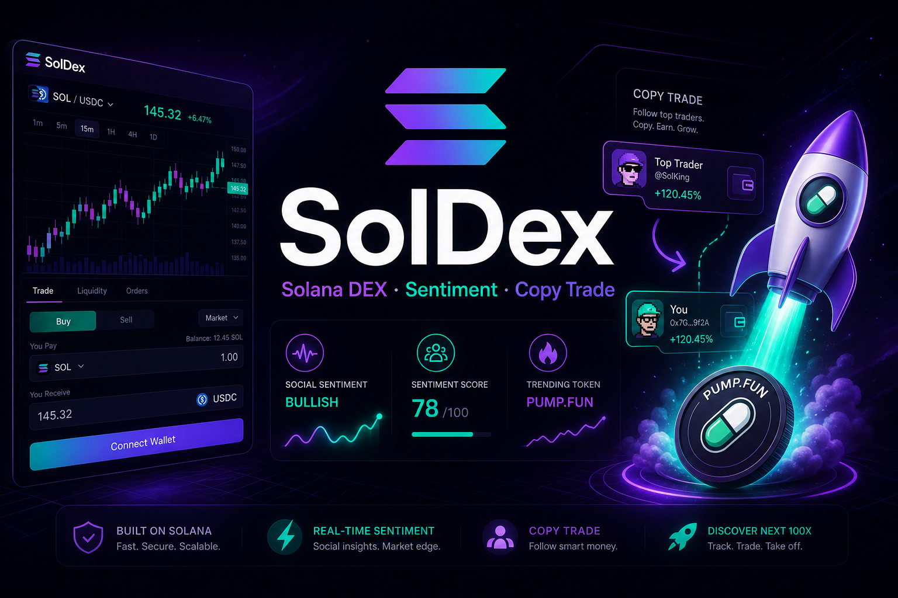
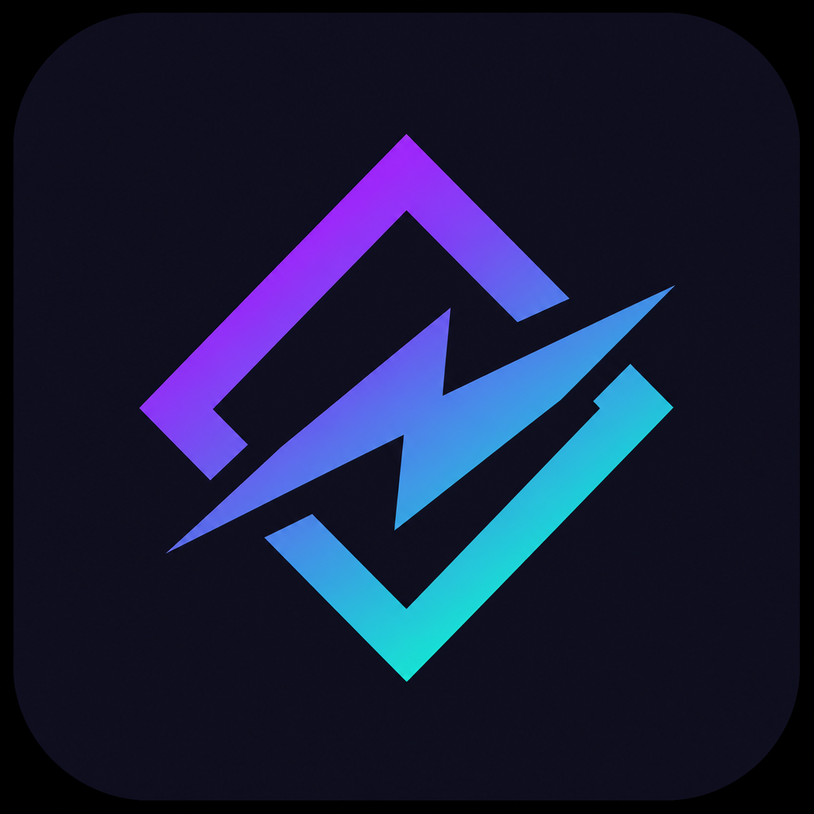
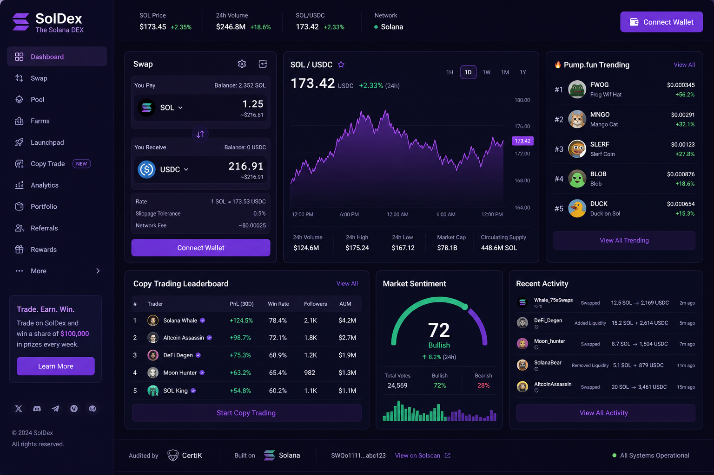
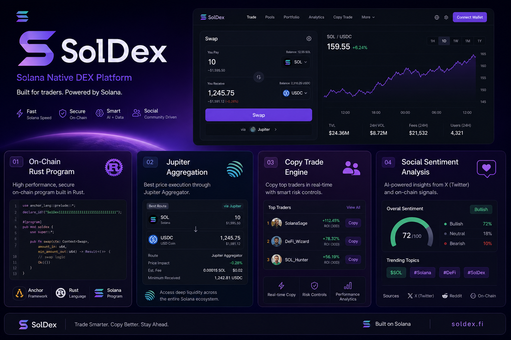

<p align="center">
  
</p>

<p align="center">
  
</p>

<h1 align="center">SolDex — Solana DEX Trading Platform</h1>

<p align="center">
  <strong>Pump.fun · Social Sentiment · Copy Trade · Auto Trade · One-click Execution</strong>
</p>

<p align="center">
  <a href="LICENSE"></a>
  <a href="https://solana.com"></a>
  <a href="https://nextjs.org"></a>
  <a href="https://www.rust-lang.org"></a>
</p>

<p align="center">
  
  
  
  
</p>

<p align="center">
  <a href="#-quick-start">🚀 Quick Start</a> ·
  <a href="docs/ARCHITECTURE.md">🏗 Architecture</a> ·
  <a href="docs/PRODUCTION.md">🔒 Production</a> ·
  <a href="#-api">📡 API</a>
</p>

---

## Portfolio gallery

| Dashboard | Feature showcase |
|:---:|:---:|
|  |  |

All images → [`assets/`](./assets/) (banner, logo, dashboard, showcase).

---

## 💼 Portfolio summary

> **Role:** Blockchain & Automation Developer (Lead)

The DEX Trading Platform with Social Sentiment Integration optimizes trading on the **Solana** blockchain. It integrates real-time **Pump.fun** token data, **Jupiter** swaps, **copy trading**, **auto trading**, and **social sentiment** scoring — with a **Next.js** dashboard, **Node.js** API, **MongoDB**, **WebSocket** realtime, and a **Rust** on-chain trade registry.

---

## Tech stack — not all JavaScript

| Layer | Tech | Language |
|---|---|---|
| **Frontend** | Next.js 14, Tailwind, Wallet Adapter | **TypeScript** |
| **API** | Express, Socket.io, Zod | **JavaScript** (Node 20) |
| **Database** | MongoDB + Mongoose | — |
| **Solana client** | `@solana/web3.js`, Jupiter API | JavaScript |
| **On-chain + services** | Trade registry, RPC, Jupiter, Pump.fun, sentiment, worker | **Rust** |
| **Sentiment** | Twitter/Telegram pipeline (mock + extensible) | JavaScript |

> **Rust** is used for the **on-chain program** (Solana native). Client + API use JS/TS — the standard for 99% of Solana dApps.

Details → **[docs/ARCHITECTURE.md](./docs/ARCHITECTURE.md)**

---

## ✨ Features

<table>
<tr>
<td width="50%">

### 📈 Trading
- Pump.fun trending tokens
- One-click buy/sell via Jupiter
- Phantom wallet connect
- Paper + devnet + live paths

</td>
<td width="50%">

### 🤖 Automation
- Copy trade leader wallets
- Auto trade on sentiment score
- Helius webhook + on-chain poll
- WebSocket live feeds

</td>
</tr>
<tr>
<td>

### 🛡 Backend
- JWT auth + MongoDB persistence
- Quote → build → sign → submit
- Idempotent trade submission

</td>
<td>

### ⛓ On-chain & Rust services
- `trade-registry` Solana program with PDAs
- `dex-solana`, `jupiter-client`, `pumpfun-client`, `sentiment-core`
- `dex-worker` background binary + `dex-cli` dev tools

</td>
</tr>
</table>

---

## 🚀 Quick start

```bash
# API
cd backend && cp .env.example .env && npm install && npm run dev

# Web (new terminal)
cd frontend && cp .env.example .env.local && npm install && npm run dev
```

- API → `http://127.0.0.1:8091`
- Web → `http://localhost:3000`

### Test

```bash
npm test      # 6 unit tests
npm run e2e   # auth → quote → build → submit → copy webhook
cd programs && cargo test --workspace   # Rust unit tests (dex-core + trade-registry)
```

### Rust workspace

```bash
cd programs
cargo test --workspace
cargo run -p dex-cli -- pda-registry
cargo run -p dex-cli -- encode-subscribe --size-bps 5000
```

See **[programs/README.md](./programs/README.md)** for on-chain instructions and PDA seeds.

### Docker

```bash
export API_SECRET="$(openssl rand -hex 24)"
export JWT_SECRET="$(openssl rand -hex 32)"
docker compose up -d --build
```

Production checklist → **[docs/PRODUCTION.md](./docs/PRODUCTION.md)**

---

## 📂 Project structure

```
solana_dex_platform/
├── 🖥 frontend/       Next.js dashboard (TypeScript)
├── ⚡ backend/        REST + WebSocket API (Node.js)
├── ⛓ programs/       Rust workspace (9 crates: on-chain + services + worker)
├── 🧪 tests/          Unit tests (6)
├── 🔄 simulator/      E2E
└── 📚 docs/           Architecture + Production + assets
```

---

## 📡 API

| Method | Endpoint | Description |
|---|---|---|
| POST | `/api/v1/auth/register` | Create account → JWT |
| POST | `/api/v1/auth/login` | Login → JWT |
| GET | `/api/v1/tokens/trending` | Pump.fun tokens |
| GET | `/api/v1/sentiment` | Sentiment scores |
| POST | `/api/v1/trade/quote` | Jupiter quote |
| POST | `/api/v1/trade/build` | Build swap tx |
| POST | `/api/v1/trade/submit` | Submit signed tx |
| POST | `/api/v1/copy/subscribe` | Copy leader wallet |
| GET | `/api/v1/registry/pdas` | Derive registry / leader / subscription PDAs |
| POST | `/webhooks/helius` | On-chain copy events |

Auth: `Authorization: Bearer <JWT>` or `X-API-Key` for service calls

---

## ⚠️ Disclaimer

For educational and portfolio purposes. Memecoin trading involves substantial risk. Not financial advice.

---

## 📄 License

MIT © **[Loc Nguyen Huu](https://github.com/lokinhh)**

<p align="center">
  <sub>⭐ Built for Solana memecoin trading with sentiment-driven automation</sub>
</p>
