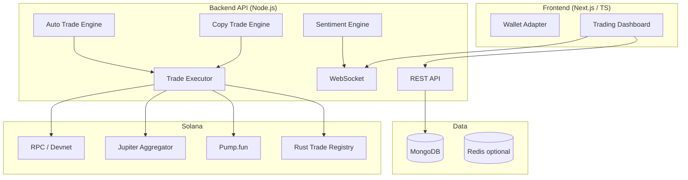

# Architecture & Tech Stack

## TL;DR — not all JavaScript

| Layer | Technology | Language |
|---|---|---|
| **Web UI** | Next.js 14, React, Tailwind | **TypeScript** |
| **REST + WebSocket API** | Express, Socket.io, Zod | **JavaScript (Node 20)** |
| **Database** | MongoDB + Mongoose | — |
| **Solana client** | `@solana/web3.js`, Jupiter API | JavaScript |
| **On-chain program** | Solana program (trade registry) | **Rust** |
| **Sentiment pipeline** | Node workers + mock social feeds | JavaScript |
| **Infra** | Docker, GitHub Actions | — |

> **Rust** is used for the **on-chain program** (Solana native).  
> **99% of Solana dApps** use **TypeScript/JavaScript** for the client and backend — full Rust APIs are rare unless you need ultra-low-latency HFT.

## System diagram

## Modules

### 1. Wallet service
- Connect Phantom / Solflare (frontend)
- Optional platform wallet derive (HD, encrypted at rest) — **demo only, non-custodial recommended for prod**

### 2. Pump.fun integration
- Real-time token metadata, bonding curve progress, market cap
- Paper mode with seeded mock tokens for dev

### 3. Jupiter swap
- Quote + swap route for SOL ↔ SPL tokens
- Slippage + priority fee config

### 4. Copy trading
- Subscribe to "leader" wallet addresses
- Mirror buys/sells with configurable size % (paper + devnet)

### 5. Auto trading
- Rule engine: sentiment score threshold, volume spike, price action
- Cron + event-driven execution

### 6. Social sentiment
- Ingest Twitter/Telegram mentions (mock feeds in dev)
- Score 0–100 per mint: mentions, velocity, holder growth proxy

### 7. Rust on-chain program

Workspace under `programs/`:

| Crate | Purpose |
|---|---|
| `trade-registry` | Solana BPF program — registry, leaders, subscriptions, intent audit log |
| `dex-core` | Shared Borsh account layouts, PDAs, instruction codec |
| `dex-cli` | CLI to derive PDAs and hex-encode instructions for devnet |

Instructions: `InitializeRegistry`, `RegisterLeader`, `UpdateLeader`, `Subscribe`, `Unsubscribe`, `LogCopyIntent`.

Backend mirror: `backend/src/services/tradeRegistryClient.js` (enable with `TRADE_REGISTRY_ENABLED=true`).

## Modes

| Mode | Use |
|---|---|
| `PAPER_TRADING=true` | No real chain txs — portfolio demo |
| `SOLANA_CLUSTER=devnet` | Real devnet txs with faucet SOL |
| `mainnet-beta` | Production (requires audit + key mgmt) |
